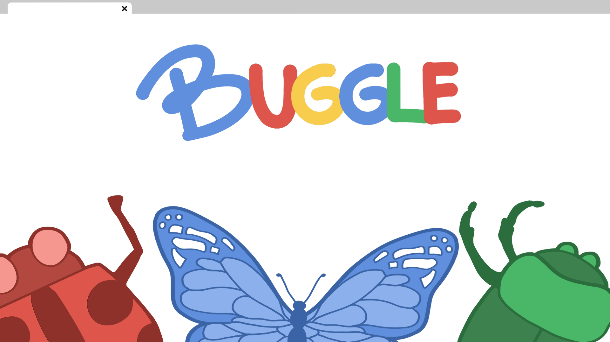

<h1>About me</h1>

<ul>
  <li>✌️ 23 years old</li>
  <li>🇵🇱 Polish</li>
  <li>🎓 Student at Creative Media and Game Technologies at Saxion University of Applied Sciences</li>
  <li>🌿 Loves cats, dogs and horses</li>
  <li>👾 Tries to get 100% in every game at own, but still fails miserably</li>
</ul>

<h1>Projects</h1>

| Project name | My contribution | Links |
| ------------- | ------------- | ------------- |
|   | <ul><li>Creating a world generation</li> <li>Creating task list</li>  |<ul><li>[Repository](https://github.com/NoahBrinkman/Project_2.4_ShowOff)</li> |
|   | <ul><li>⭐️ Lead Engineer</li><li>Networking connection</li><li>Cameras movement</li> |<ul><li>[Repository](https://github.com/kamuuucka/Project-Innovation)</li> <li>[Itchi.io](https://plamczak66.itch.io/escape-baba-yaga)</li>|
|   | <ul><li>AI and genetics research</li> | <ul><li>[Repository](https://github.com/kamuuucka/SmartBoats)</li> |
|   | <ul><li>⭐️ Lead Engineer</li><li>Letters generation</li><li>Connection between words and animation</li> | <ul><li>[Repository](https://github.com/kamuuucka/Project-Start-Up/tree/master)</li> <li>[Itchi.io](https://plamczak66.itch.io/stepup-fred)</li> |
|   | <ul><li>⭐️ Lead Engineer</li><li>Physics</li><li>Sprites placement</li> | <ul><li>[Repository](https://github.com/kamuuucka/projeft-final-approach)</li> <li>[Itchi.io](https://plamczak66.itch.io/burn-the-mob)</li> |
|  | <ul><li>⭐️ Only Engineer </li><li>Concepting</li> | <ul><li>[Repository](https://github.com/kamuuucka/GameJamBugs)</li> <li>[Itchi.io](https://plamczak66.itch.io/buggle)</li> |
  

<!--
**kamuuucka/kamuuucka** is a ✨ _special_ ✨ repository because its `README.md` (this file) appears on your GitHub profile.

Here are some ideas to get you started:

- 🔭 I’m currently working on ...
- 🌱 I’m currently learning ...
- 👯 I’m looking to collaborate on ...
- 🤔 I’m looking for help with ...
- 💬 Ask me about ...
- 📫 How to reach me: ...
- 😄 Pronouns: ...
- ⚡ Fun fact: ...
-->
